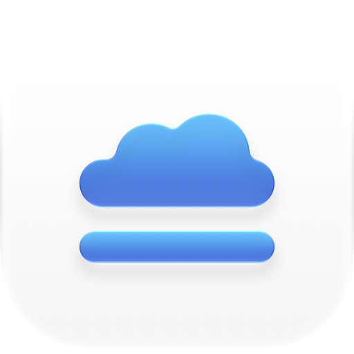

<p align="center">
  <picture>
    <source media="(prefers-color-scheme: dark)" srcset="assets/logo.png">
    
  </picture>
</p>

<h1 align="center">UnlocalFS</h1>

UnlocalFS puts your S3 bucket in Finder. Add a bucket once, click **Connect**, and it shows up as a drive you can browse, open, and save to like any other folder on your Mac. You can connect the whole bucket, or just one folder of it as its own drive.

It works with Amazon S3, Cloudflare R2, MinIO, Wasabi, DigitalOcean Spaces, and any other S3-compatible storage.

## Features

- **Finder integration:** Open, edit, and save files in your S3 bucket like any other folder on your Mac.
- **Encrypted drives:** Encrypt file contents and names before upload, so your storage provider can’t read them.
- **Mount a folder as a drive:** Turn one folder in a bucket into its own drive.
- **Read-only drives:** Open files while blocking apps from changing or deleting them through the drive.
- **Automatic connections:** Open UnlocalFS at login and connect your chosen drives automatically.
- **Safe disconnects:** Prevent a drive from disconnecting while uploads are pending or need a retry.
- **Drive health:** Check drives after wake and network changes. Reconnect an unavailable drive while keeping its cache.
- **Notifications:** Get told when uploads fail, and when a drive you tried to disconnect finishes uploading.
- **Sharing links:** Right-click a file in Finder to copy a link that expires after 1 hour, 1 day, or 7 days.
- **Refresh files:** See changes made from other apps or Macs right away.
- **Duplicate connections:** Reuse a drive’s settings and credentials to connect another folder quickly.
- **No tracking:** Connect directly to your storage provider, with no UnlocalFS account, analytics, or telemetry.

## How it works

UnlocalFS runs [rclone](https://rclone.org), the open-source cloud storage tool, and connects it to the NFS client that is built into macOS. There is no kernel extension, no FUSE driver, and no administrator password. rclone is bundled inside the app, so there is nothing else to install.

Drives mount in `~/UnlocalFS`. Files you open are cached on your Mac, so apps can read and edit them at local speed. Changes upload to your bucket after you close the file. The app shows pending uploads and will not disconnect a drive until they finish.

Select a connected drive to see its activity: queued uploads, uploads waiting to retry, and active uploads and downloads with progress when available. The list refreshes every few seconds. Deletions are not shown because rclone does not report Finder deletions in its activity data. Disconnect the drive yourself when you are finished.

UnlocalFS sends a notification when files on a drive cannot upload. If you click **Disconnect** while uploads are pending, it also tells you when they finish, so you know it is safe to disconnect.

Changes made to the bucket from other apps or Macs show within 5 minutes. To see them sooner, choose **Refresh Files** in the app, the sidebar menu, or the menu bar.

If a drive shows **Needs reconnect**, click **Reconnect** in the app or menu bar. UnlocalFS tries a normal eject, waits for the old service to stop, and connects again using the same cache. Recovery stops if the drive cannot eject or the old service cannot be stopped. Wake and network changes refresh drive health; reconnecting stays manual.

## Privacy

- Your access key, secret key, and encryption password are stored in the macOS Keychain.
- Turn on **Encrypt files** to encrypt files and file names on your Mac before they upload. See [Encrypted drives](#encrypted-drives).
- UnlocalFS talks only to the storage endpoint you enter. There is no UnlocalFS server, account, analytics, or telemetry.
- Requests are signed on your Mac. Your secret key is never sent over the network, not even to your storage provider.

## Install

Download the latest `UnlocalFS-<version>.zip` from [Releases](https://github.com/luizkowalski/unlocalfs/releases), unzip it, and move **UnlocalFS** to Applications. It needs macOS 15 or later and runs on Apple silicon and Intel Macs.

The app is not notarized yet, so macOS blocks it the first time. Remove the quarantine flag:

```sh
xattr -dr com.apple.quarantine /Applications/UnlocalFS.app
```

You can also open the app once, then choose **System Settings → Privacy & Security → Open Anyway**.

## Use

1. Click **Add Connection**.
2. Enter a name, your provider, the bucket, the endpoint, and the region. Use the service endpoint without the bucket name. For Cloudflare R2, use `https://<ACCOUNT_ID>.r2.cloudflarestorage.com` and region `auto`.
3. Enter your access key and secret key, then click **Test Connection** and **Save**.
4. Click **Connect**, then **Open in Finder**.

Closing the window removes UnlocalFS from the Dock and keeps it in the menu bar, where you can connect, disconnect, and open drives. Choose **Open UnlocalFS** to show the window and Dock icon again. UnlocalFS will not quit while a drive is connected, so pending uploads are never cut off. Disconnect your drives first. If the app closes unexpectedly, the drives keep running and the app picks them up again the next time it opens.

## Folder drives

A drive can show one folder of a bucket instead of the whole bucket. Enter the folder path in **Folder**, for example `clients/acme`, and the drive opens straight into that folder. This is handy for a big shared bucket: make one drive per project, client, or type of file.

To add another folder from the same bucket, select a drive and choose **Duplicate**. The copy keeps the endpoint, bucket, and credentials, so you only change the name and the folder.

A folder limits what the drive shows. It does not limit access: the keys can still reach the whole bucket. To block writes, turn on **Read-only** in the drive settings. Apps then cannot create, change, or delete files on the drive. For full protection, use keys that only have read access. If two drives show the same files, a change in one shows in the other within 5 minutes or when you choose **Refresh Files**, and saving the same file from both at once can overwrite one of the edits.

## Encrypted drives

Turn on **Encrypt files** when you add a drive. UnlocalFS encrypts the content and the names of your files on your Mac before they upload, so your storage provider sees only random names and data. It uses [rclone crypt](https://rclone.org/crypt/) with the default settings, so you can also read the files with rclone and the same password.

- Keep the password in a safe place. If you lose it, nobody can read the files, including you.
- You cannot turn encryption on or off after you add a drive. To encrypt files you already have, add an encrypted drive with an empty folder and copy the files to it.
- If the top folder of the drive has names that the password cannot decrypt, the drive does not connect. This happens when the password is wrong or when the folder also has files that are not encrypted.
- Encrypted names are longer than the original names. Some providers limit the length of a file path.

## Sharing links

Right-click a file in a connected drive, choose **Services**, then **Copy Share Link (1 Hour)**, **Copy Share Link (1 Day)**, or **Copy Share Link (7 Days)**. UnlocalFS copies a presigned link to the clipboard and sends a notification. Anyone with the link can download the file until the link expires. They do not need your keys. If you select more than one file, you get one link on each line.

- Links are not available for encrypted drives, because the link would point to encrypted data. The Services entries still show for these drives, but UnlocalFS tells you why it did not copy a link.
- Wait until a file finishes uploading before you copy its link. If the drive shows **Needs reconnect**, reconnect it first.
- You cannot cancel a link before it expires. To stop all links early, replace the access key.
- A link includes your access key ID, but never your secret key. If you use temporary credentials, the link stops working when the credentials expire.
- If the entries do not show, open UnlocalFS once. You can turn them on and add keyboard shortcuts in **System Settings → Keyboard → Keyboard Shortcuts → Services → Files and Folders**.

## Shortcuts

| Action | Shortcut |
|---|---|
| New connection | ⌘N |
| Edit the selected connection | ⌘E |
| Duplicate the selected connection | ⌘D |

Right-click a drive in the sidebar to open it in Finder, edit, duplicate, or delete it. You can only edit or delete a drive while it is disconnected.

## Good to know

- S3 is not a local disk. Saving a large file takes as long as uploading it. Try UnlocalFS with files you have copies of first.
- S3 has no real folders, so folders show the time the drive connected as their modification date. Files show their own dates.
- Each drive has a cache limit (default 128 MB) and an optional amount of disk space to keep free. When the cache is over the limit, rclone removes the files you have not opened for the longest time. Open files and pending uploads stay, so the cache can go over the limit for a short time. The cache lives in `~/Library/Application Support/UnlocalFS/cache`. Do not delete it while uploads are pending.
- Open **Advanced** in a drive’s settings to limit its bandwidth or change the number of files transferred at once. Bandwidth is unlimited by default and rclone transfers four files in parallel by default. The bandwidth choices are in MB/s and apply to uploads and downloads.
- Finder writes `.DS_Store` files to folders you open, and they upload to your bucket like other files. To stop Finder from writing them on network drives, run the commands below. This setting applies to all network drives, not only UnlocalFS. macOS can also add `._` files when you copy files that have extended attributes. UnlocalFS cannot stop these files.

  ```sh
  defaults write com.apple.desktopservices DSDontWriteNetworkStores -bool true
  killall Finder
  ```

- To connect a drive when UnlocalFS opens, turn on **Connect on start up** in its settings. To open UnlocalFS when you log in, choose **Open at Login** in the menu bar.
- Logs are in `~/Library/Logs/UnlocalFS`. Click **Open Log** in the app to see the log of a drive.

## Build from source

You need Xcode and [Mise](https://mise.jdx.dev/getting-started.html):

```sh
mise install
mise app               # builds dist/UnlocalFS.app
mise test              # runs the unit tests
mise test:integration  # also mounts a drive against a local S3 server and uses Keychain
mise lint              # runs SwiftLint
mise xcode             # opens the project in Xcode
```

The tasks wrap the scripts in `scripts/`, which is what CI runs. CI lints, runs every test on macOS 15 and 26, and builds the app for every pull request and every push to `main`. Publishing a GitHub release builds the app and attaches it to the release. The release tag sets the app version.

## License

UnlocalFS bundles rclone, which is released under the [MIT License](https://github.com/rclone/rclone/blob/master/COPYING). See `packaging/THIRD_PARTY_NOTICES.txt`.
