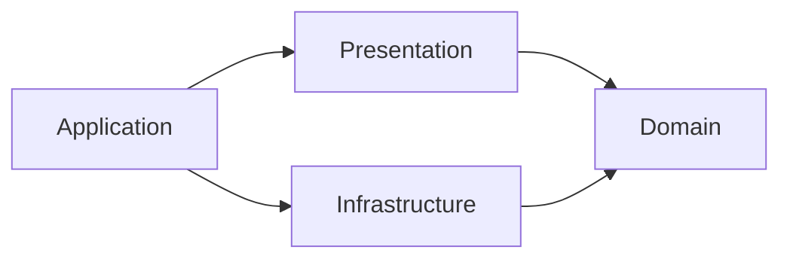

# Clean Architecture with MVVM

The domain defines what the app does. Infrastructure implements storage and drive operations. Presentation owns observable state and user interaction. Application constructs the objects and connects them to macOS.

## Domain

`Packages/UnlocalFSCore/Sources/UnlocalFSDomain` contains connection and credential validation, duplication, automatic-connect eligibility, upload safety rules, and workflows:

| Use case | Behavior |
| --- | --- |
| SaveConnectionUseCase | Validates current saved names and credentials, refuses to change a saved drive's protocol and a saved SFTP drive's folder or encryption, drops credentials the connection no longer uses, prepares credentials, then saves |
| DeleteConnectionUseCase | Refuses active drives, removes the saved connection and cache |
| ToggleDriveUseCase | Uses current drive status to connect, disconnect, or reconnect |
| ShareFilesUseCase | Resolves selected files to drives and creates links, refusing SFTP, GCS, and encrypted drives before it loads credentials; identifies the failed file |
| ExportRcloneConfigUseCase | Refuses unencrypted drives, reads credentials only when the export includes them, then writes the rclone config |
| QuitUseCase | Refuses quit during an operation or while a drive remains active |

`ValidationResult<Field>` collects ordered, typed issues for any domain model. Connection and credential validation own their rules; the editor owns focus order. `ConnectionField` names each reported field, so the editor maps errors to inputs without string matching. `ConnectionRepository` and `DriveGateway` are the domain's integration contracts. Simple status, test, refresh, and activity operations use the gateway directly. The domain imports Foundation and has no remote package, UI, Security, subprocess, or filesystem implementation dependencies.

## Infrastructure

`UnlocalFSInfrastructure` depends on Domain. `SavedConnectionRepository` combines `ConnectionStore` and `CredentialStorage`. The application shares one repository instance. A lock serializes complete repository transactions. A failed credential save restores the previous JSON connection or removes a new connection. Delete removes the JSON connection before its credentials, so a failed write keeps both. `Keychain` implements credential storage.

`MountService` implements `DriveGateway`. It owns rclone commands, response decoding, process lifetime, and mount paths. `RcloneRemote` describes how rclone reaches a connection's storage: the backend type, path, options, environment, and recovery export name. The provider selects the S3, GCS, or SFTP branch; all share one mount lifecycle, and crypt wraps any of them. GCS passes the service-account key from `Credentials` as an inline rclone option; `ServiceAccountKey` parses and compacts the imported file once, in Domain. SFTP checks the trusted-hosts and key files before every test and mount, passes only the ssh-agent socket it needs, and never edits the trusted-hosts file. `MountCommand` builds the `nfsmount` arguments and environment from a remote and `AppPaths`. It checks upload safety before ejecting and again before stopping the service. These checks stay at the integration boundary because uploads can change between operations.

JSON and Keychain encoding remain compatible with existing installations. Foundation Codable conformance stays on the value types to avoid duplicating unchanged schemas.

## Presentation and Application

`UnlocalFSPresentation` contains the view models and depends only on Domain. `AppViewModel` holds connection selection, observed statuses, errors, and busy state. Views read this state and cannot change it directly; they call intent methods such as `toggle`, `delete`, and `checkAgain`. `AppViewModel` also derives the status text, indicator, and notices that views display. It runs domain use cases and translates their results into UI state and desktop feedback.

`ViewModelFactory` creates `ConnectionEditorViewModel` and `ActivityViewModel` with their dependencies. Views get the factory from the environment, so they do not know about repositories, gateways, or use cases. The feature view models have internal initializers.

`UnlocalFS/Presentation` contains the SwiftUI views. `AppDependencies.live()` constructs live dependencies and loads initial connections. `MacOSDesktopServices` implements the presentation's desktop interface. `AppDelegate` owns app polling, network monitoring, sleep/wake events, termination, and Finder services. Views own focus, layout, sheet dismissal, and activity task lifetime.

## Verification

`xcodebuild test` runs all Domain, Infrastructure, and Presentation tests, including real rclone, isolated Keychain tests, and SFTP tests against `rclone serve sftp` with generated keys, a private trusted-hosts file, and an isolated ssh-agent. Test fixtures fetch the pinned rclone binary automatically. GCS tests use synthetic credentials and local process boundaries; they never require a real bucket. Tests use real repositories and drive services with stubs at process, credential, or macOS boundaries. `mise test` calls `xcodebuild` directly with the same package scheme and Debug configuration as CI. `scripts/lint.sh` checks all layers.

For a new workflow, place its rules in Domain, implement required integration behavior in Infrastructure, and inject it from Application. Keep view models responsible for the state the UI displays, and add a factory method when a view needs a new feature view model. Add abstractions when a real boundary requires them.
