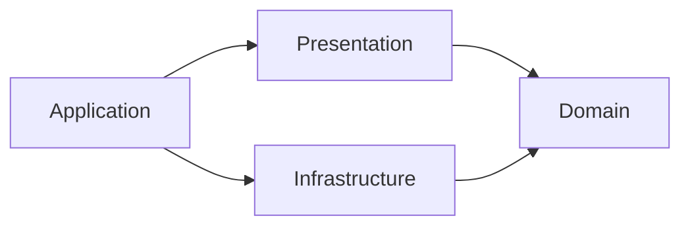

# Clean Architecture with MVVM

The domain defines what the app does. Infrastructure implements storage and drive operations. Presentation owns observable state and user interaction. Application constructs the objects and connects them to macOS. In MVVM terms, Domain and Infrastructure are the model, `UnlocalFSPresentation` holds the view models, and the SwiftUI views live in the app target with Application.

## Domain

`Packages/UnlocalFSCore/Sources/UnlocalFSDomain` contains connection and credential validation, duplication, automatic-connect eligibility, upload safety rules, and workflows:

| Use case | Behavior |
| --- | --- |
| SaveConnectionUseCase | Validates current saved names and credentials, refuses to change a saved drive's protocol and a saved SFTP drive's folder or encryption, drops credentials the connection no longer uses, prepares credentials, then saves |
| DeleteConnectionUseCase | Refuses active drives, removes the saved connection and cache |
| ConnectDriveUseCase | Uses current drive status to connect or reconnect; view models disconnect through the gateway |
| ShareFilesUseCase | Resolves selected files to drives and creates links, refusing SFTP, GCS, and encrypted drives before it loads credentials; identifies the failed file |
| DuplicateFilesUseCase | Resolves selected files to drives and copies each one on the server, refusing SFTP and read-only drives; never loads credentials; identifies the failed file |
| ExportRcloneConfigUseCase | Refuses unencrypted drives, reads credentials only when the export includes them, then writes the rclone config |
| QuitUseCase | Refuses quit during an operation or while a drive remains active |

`ValidationResult<Field>` collects ordered, typed issues for any domain model. Connection and credential validation own their rules; the editor owns focus order. `ConnectionField` names each reported field, so the editor maps errors to inputs without string matching. `ConnectionRepository` and `DriveGateway` are the domain's integration contracts. View models call the gateway directly for simple status, test, refresh, and activity operations; workflows with rules go through a use case. The domain imports Foundation and has no remote package, UI, Security, subprocess, or filesystem implementation dependencies.

## Infrastructure

`UnlocalFSInfrastructure` depends on Domain. `SavedConnectionRepository` combines `ConnectionStore` and `CredentialStorage`. The application shares one repository instance. A lock serializes complete repository transactions. A failed credential save restores the previous JSON connection or removes a new connection. Delete removes the JSON connection before its credentials, so a failed write keeps both. `Keychain` implements credential storage.

`MountService` implements `DriveGateway`. It owns rclone commands, response decoding, process lifetime, and mount paths. `RcloneRemote` describes how rclone reaches a connection's storage: the backend type, path, options, environment, and recovery export name. The provider selects the S3, GCS, or SFTP branch; all share one mount lifecycle, and crypt wraps any of them. GCS passes the service-account key from `Credentials` as an inline rclone option; `ServiceAccountKey` parses and compacts the imported file once, in Domain. SFTP checks host keys before authentication and passes only the ssh-agent socket it needs. `SFTPTrustStore` owns the only trusted-hosts file, `known_hosts` under Application Support. `RcloneRemote` requires its path, so no SFTP command runs without host verification. Unknown or changed keys produce a domain `ServerTrustChallenge`; `AppViewModel` selects the connection so its detail view shows the fingerprints, and both view models retry after approval. OpenSSH tools scan keys, calculate fingerprints, and remove replaced entries. Approval saves only the reviewed keys, so a later key change still fails verification. `DeleteConnectionUseCase` removes a server's keys when the last drive for that host and port is deleted. `MountCommand` builds the `nfsmount` arguments and environment from a remote and `AppPaths`. `MountService` checks upload safety before ejecting and again before stopping the service. It duplicates files with `operations/copyfile` on the drive's rc socket, so the copy runs in the drive's rclone process with the credentials it already has. It picks a free copy name from a listing of the mounted folder, a remote check, and the names of copies still running, and it refuses to disconnect while a copy runs. These checks stay at the integration boundary because uploads can change between operations.

JSON and Keychain encoding remain compatible with existing installations. Foundation Codable conformance stays on the value types to avoid duplicating unchanged schemas.

## Presentation and Application

`UnlocalFSPresentation` contains the view models and depends only on Domain. `AppViewModel` holds connection selection, observed statuses, errors, and busy state. Views cannot change connections, statuses, errors, or busy state; they call intent methods such as `toggle`, `delete`, and `checkAgain`. Views can set the selection and what is presented: the editor, the delete confirmation, and alerts. `AppViewModel` also derives the status text, indicator, and notices that views display. It runs domain use cases and translates their results into UI state and desktop feedback.

`ViewModelFactory` creates `ConnectionEditorViewModel` and `ActivityViewModel` with their dependencies. Views get the factory from the environment, so they do not know about repositories, gateways, or use cases. The feature view models have internal initializers, so only the factory can create them.

While the activity card is visible, `ActivityViewModel` polls the gateway every 3 seconds and exposes a `TransferSummary` with what the card shows: whether uploads or downloads lead (uploads win when both run), the file count and bytes left in that direction, the speed in that direction, the upload time left, and the first 10 files with moving files first. The gateway returns activity in no set order; display order belongs to Presentation.

`UnlocalFS/Presentation` contains the SwiftUI views. Views own focus, layout, sheet dismissal, and activity task lifetime. The app target has no tests, so view models decide what the UI shows: which items, in what order, and derived counts and totals. Views decide how it looks: icons, colors, animation, and the format of a single value.

`UnlocalFS/Application` wires the app. `AppDependencies.live()` constructs live dependencies and loads initial connections. `MacOSDesktopServices` implements the presentation's desktop interface. `AppDelegate` owns app polling of drive status every 3 seconds, network monitoring, sleep/wake events, termination, and Finder services.

## Verification

`xcodebuild test -scheme UnlocalFSCore-Package` runs all Domain, Infrastructure, and Presentation tests in one pass. Tests use real repositories and drive services with stubs at process, credential, or macOS boundaries. One storage suite per type (S3, SFTP, GCS) runs the pinned rclone against a local `rclone serve` server to check that a drive downloads, uploads, and deletes files, with isolated fixtures that run in parallel. GCS has no local server, so its suite checks only the rclone config. CI runs the same command across the supported macOS/Xcode matrix. `swiftlint lint --strict` checks all layers. See [tests](testing.md) for what to test and where.

For a new workflow, place its rules in Domain, implement required integration behavior in Infrastructure, and inject it from Application. Keep view models responsible for the state the UI displays, and add a factory method when a view needs a new feature view model. Add abstractions when a real boundary requires them.
